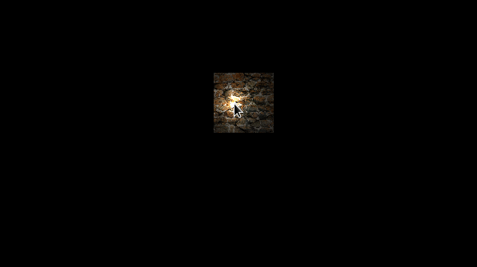

# Flow Engine

A 3D Engine written in OpenGL just for fun. :smile:

The goal of this project is to create a generic API for realistic graphics ([Physically Based Rendering](https://sketchfab.com/pbr)) and physics.

The API is completely open source, so you are free to do whatever you want with it :wink:.

It will also be the basis for another project I'm working on ([a custom file format dedicated to Blender](https://github.com/massile/sls-blender-exporter))
it will be a good opportunity to test if the models load correctly.

## Libraries

As I am developing on Linux, the graphics library I use for this projet is OpenGL 3.3.

To build the core and graphics engine faster, I rely on these other libraries:

 - [GLFW 3] (http://www.glfw.org/index.html) - for the Window / Event system
 - [GLEW] (http://glew.sourceforge.net/) - to fetch OpenGL pointers
 - [GLM] (http://glm.g-truc.net/0.9.8/index.html) - a math library for OpenGL
 - [SOIL] (http://www.lonesock.net/soil.html) - to load images as a series of pixels for OpenGL
 
In the long run, these libraries will be replaced by custom ones.
OS targeted : Windows / Linux

## 3D Engine 

The 3D engine has the following features: 
    - window system
    - keyboard and mouse event system
    - camera handling (translation, orientation)
    - point lights (CookTorrance)
    - model loading (.obj)
    - component based entities
    - mesh factory
    - material system

Check the [release notes](https://github.com/massile/FlowEngine/releases) for more details.

 Here are some examples:

 
 

## 2D Engine

The renderer can render up to 60 000 sprites on the screen at 500 fps with the following features:
   - Basic shader loading
   - Object oriented buffer & vertex arrays
   - Texture loading and texture arrays (32 textures on the array)
   - Mask texture rendering (only one, taking the entire screen)
   - Multiple layers of sprite
   - Scene graphs
   - Multiple render targets (screen or buffer)

   Here are some examples:
   

Check the [release notes](https://github.com/massile/FlowEngine/releases) for more details.
